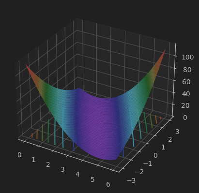
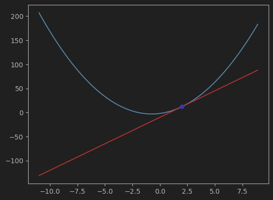
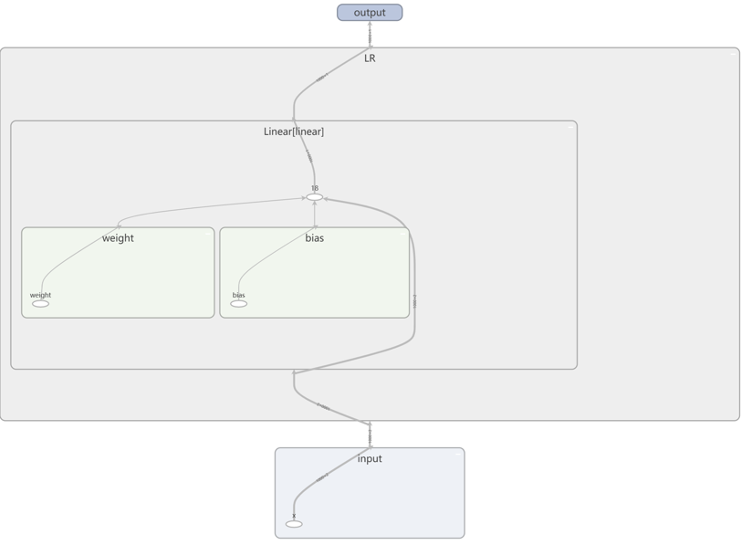
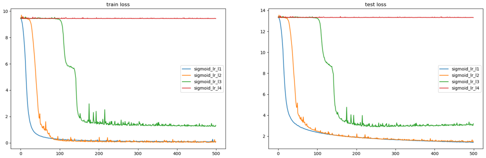
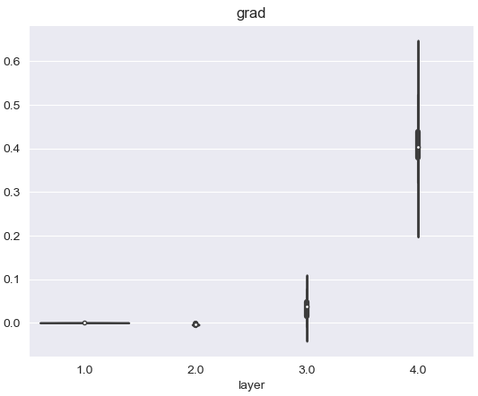
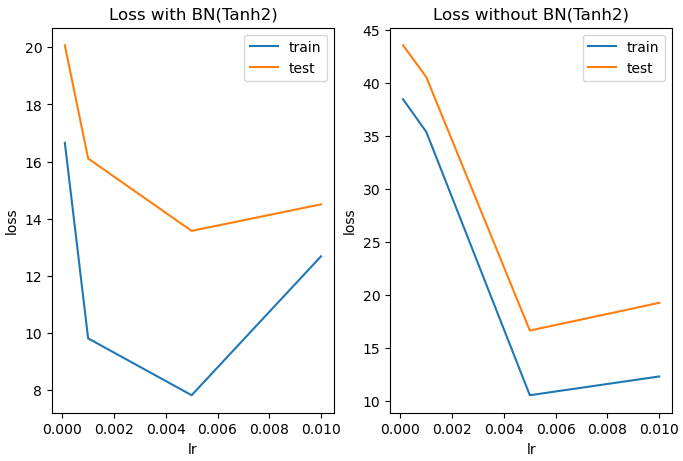
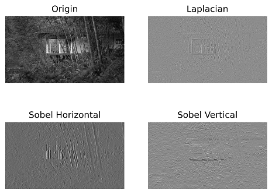

## PyTorch深度学习实战

作为Meta开源的深度学习框架，[PyTorch](https://github.com/pytorch/pytorch/)在近几年的发展中被越来越多的人使用，不论是**学术界**还是**工业界**、学生还是上班族，PyTorch被越来越多的人追捧。比于TensorFlow的**静态计算图**，PyTorch的**动态图**可以带来更大的灵活性，提供了各种张量操作并通过自动求导可以自动进行梯度计算，方便构建各种神经网络模型，同时支持使用**GPU/TPU加速计算**。本仓库提供了使用PyTorch进行深度学习的最佳实践，从深度学习环境搭建与张量基础入手，从0到1自由构筑和训练神经网络，通过优化网络保障高分结果和运行效率，同时着力于深度架构落地实践，最后通过一线CV（和NLP）企业级应用提升实战能力。项目以Jupyter Notebook为主，兼顾了理论基础和最佳实现，而不只是空洞的代码，适合小白入门；通过若干案例和大项目巩固实战和项目迁移能力；并提供多种优化手段助力论文和比赛提分。

### 环境

所有代码都是在以下环境中编写和调试：

- Python 3.9.13
- PyTorch 1.11.0
- CudaToolkit 1.11.1
- CUDA 1.11
- Conda 22.11.1

完整的环境依赖可查看[requirements.txt](requirements.txt)，只需要安装主要的库即可：

```shell
conda create -n handsondlbase python=3.9.10 -y
conda install pytorch==1.11.0 cudatoolkit=11.1 -c pytorch -c conda-forge -y
conda install pandas matplotlib seaborn jupyter scikit-learn tensorboard -y
conda install torchvision=0.12.0 -c pytorch --no-deps -y
pip install tqdm opencv-python
```

如果不需要GPU版，也可以不安装cudatoolkit、直接安装PyTorch。

### 目录

1. 深度学习环境和PyTorch基础
   - [张量的创建和索引](1_basic_of_deep_learning_with_pytorch/tensor_create_index.ipynb)
   - [张量的索引、分片、合并以及维度调整](1_basic_of_deep_learning_with_pytorch/tensor_index_slice_merge.ipynb)
   - [张量的广播和科学运算](1_basic_of_deep_learning_with_pytorch/tensor_broadcast_computing.ipynb)
   - [张量的线性代数运算](1_basic_of_deep_learning_with_pytorch/tensor_linear_algebra.ipynb)
   - [基本优化思想与最小二乘法](1_basic_of_deep_learning_with_pytorch/optimization_and_least_square.ipynb)
   - [动态计算图与梯度下降入门](1_basic_of_deep_learning_with_pytorch/dynamic_computational_graph_and_gradient_descent.ipynb)
2. 从0搭建神经网络
   - [认识深度学习和PyTorch](2_build_a_neural_network_from_scratch/introductory_dl_and_pytorch.ipynb)
   - [单层神经网络](2_build_a_neural_network_from_scratch/single_layer_neural_network.ipynb)
   - [深层神经网络](2_build_a_neural_network_from_scratch/deep_neural_network.ipynb)
3. 神经网络的训练和预测
   - [神经网络的损失函数](3_training_and_prediction_of_neural_network/loss_function_of_neural_network.ipynb)
   - [神经网络的学习](3_training_and_prediction_of_neural_network/learning_of_neural_network.ipynb)
   - [深度学习基础网络的手动搭建与快速实现](3_training_and_prediction_of_neural_network/building_and_importing_of_basic_neural_network.ipynb)
4. 神经网络训练的稳定性与优化
   - [深度学习建模目标与模型欠拟合](4_stability_and_optimization_of_neural_network/modeling_objective_and_model_underfitting_in_deep_learning.ipynb)
   - [梯度不平稳性与Dead ReLU Problem](4_stability_and_optimization_of_neural_network/gradient_instability_and_dead_relu_problem.ipynb)
   - [Xavier与Kaiming参数初始化](4_stability_and_optimization_of_neural_network/xavier_and_kaiming_weight_initialization.ipynb)
   - [数据归一化与Batch Norm](4_stability_and_optimization_of_neural_network/data_normalization_and_batch_norm.ipynb)
   - [学习率调度](4_stability_and_optimization_of_neural_network/learning_rate_scheduling.ipynb)
5. 深度视觉与卷积神经网络
   - [图像处理与卷积神经网络](5_deep_vision_and_convolutional_neural_network/image_processing_and_convolutional_neural_network.ipynb)
   - [经典卷积神经网络与模型评估](5_deep_vision_and_convolutional_neural_network/classical_convolutional_neural_networks_and_model_architecture_evaluation.ipynb)

### 运行结果示例

一些实际运行的效果示例如下：

- SSE损失的3维图像

  
- 导数与梯度

  
- TensorBoard可视化示例

  
- Sigmoid激活函数堆叠效应

  
- 存在梯度消失的模型的各层梯度小提琴图

  
- 带BN的模型的学习率的U型学习曲线

  
- OpenCV使用拉普拉斯算子和索贝尔算子进行边缘检测

  

### 持续更新中……

### 交流与反馈

欢迎您通过Github Issues来提交问题、报告与建议：

- 个人主页：[https://github.com/corleytd](https://github.com/corleytd)
- 个人邮箱：[cutercorleytd@gmail.com](mailto:cutercorleytd@gmail.com)
